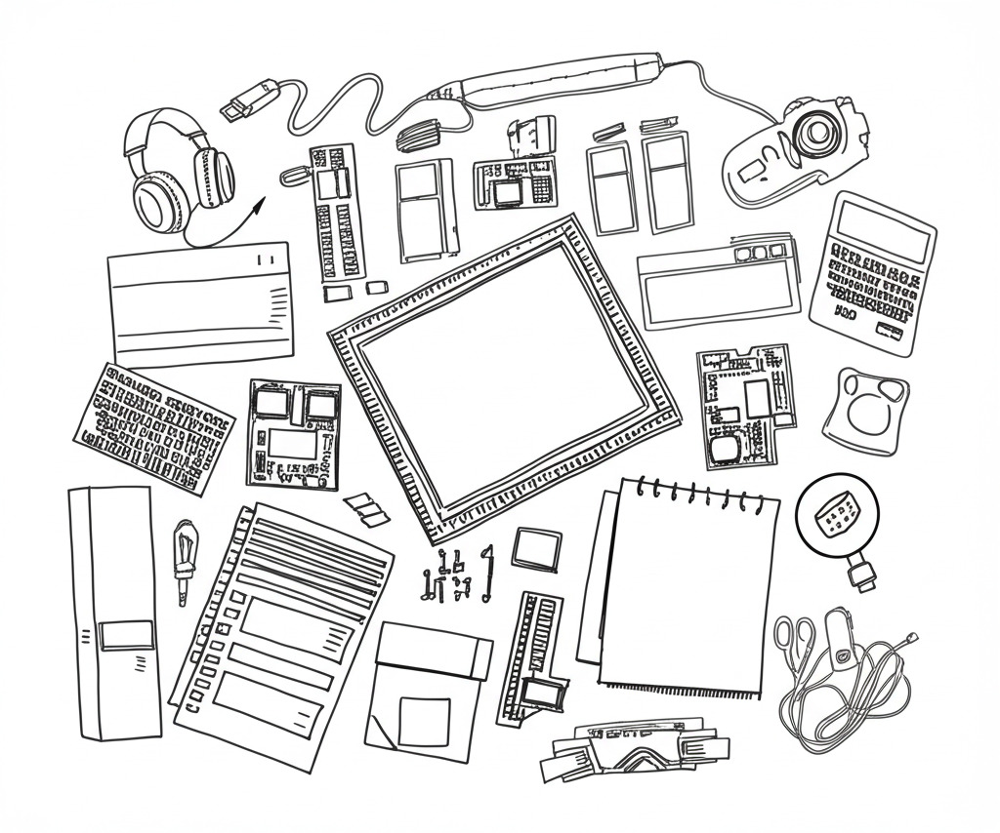

# 假如在焦油坑內詠唱而沒有人在附近聽見，它有沒有發出聲音？

改寫自 《人月神話：軟體專案管理之道》（英語：The Mythical Man-Month: Essays on Software Engineering）第1章 焦油坑（The Tar Pit），並融入現代 AI 開發趨勢

想像一下，在很久很久以前的史前時代，有個讓人看了心驚膽跳的畫面：一頭巨大的猛獁象，或是一隻威風凜凜的劍齒虎，不小心失足掉進了一個又黑又黏的焦油坑裡。牠們本能地猛烈掙扎，拼命想爬出來，但牠們越是用力，焦油就纏得越緊，彷彿有生命般吸住牠們。沒有任何猛獸的力量或技巧足以掙脫這致命的擁抱，最終只能絕望地、慢慢地沉入坑底……。

這景象聽起來或許遙遠又有點殘酷，但說來奇妙，過去幾十年來，許多開發大型電腦系統（像是那些超複雜的遊戲、功能包山包海的網站，或是每天幾百萬人使用的App）的過程，竟然和這焦油坑驚人地相似。許多充滿雄心壯志、資源豐沛的團隊，就像那些史前巨獸一樣，在這個無形的「焦油坑」裡痛苦地掙扎。他們大多數最終還是交出了可以運作的系統，但回頭檢視，真正能完全達成最初設定的目標、準時完成，並且沒有超出預算的，卻是少之又少。

無論團隊規模大小，無論是經驗老到的專家還是充滿活力的年輕人，似乎一個接一個，都在這泥淖中越陷越深。奇怪的是，如果仔細去看遇到的每個困難，好像沒有哪個是單獨看來無法解決的。每個小麻煩、小bug，似乎都有對應的方法可以處理。然而，當這些看似能克服的小問題糾纏在一起，像滾雪球般越積越多時，整個團隊前進的速度就莫名地慢了下來，行動變得異常沉重。每個身在其中的人，似乎都對這種「明明看起來不難，做起來卻卡關連連」的困境感到驚訝，也很難一眼看穿問題的根源究竟在哪裡。

不過，面對困境，光是驚訝是沒用的。如果我們真心想要找到出路，那麼第一步，就必須先靜下心來，好好地試著去理解這個「焦油坑」到底是怎麼一回事。特別是在生成式 AI 工具日益強大的今天，這個焦油坑是否會改變樣貌？新的開發方式能否幫助我們避開陷阱？

讓我們先一起來認識一下「寫程式」這個迷人的領域，聊聊它傳統上的樂趣與苦惱，以及為什麼它常常會變成一個「焦油坑」。

照片 1:

- 主題描述： 一個史前場景，一隻巨大的猛獁象（或劍齒虎）掙扎著陷入一個黏稠、黑色的焦油坑中，周圍是荒涼的史前環境。
- 視覺效果： 強調猛獸的巨大身軀與焦油坑的束縛感，牠的絕望掙扎與周圍環境的靜態形成對比。


# 從一個人的「程式」到大家都能用的「系統產品」：焦油坑的形成

你可能曾在新聞報導或網路文章上看過這樣的故事：某兩個充滿熱情的年輕人，在自家改裝的簡陋車庫裡，敲敲打打，竟然就寫出了一個功能強大、影響深遠的程式，成就甚至超過了許多大公司投入大量人力物力的團隊！許多學習或從事程式設計的人聽到這種「車庫傳奇」，心裡難免會燃起一絲希望，甚至深信不疑：「沒錯！如果讓我專心自己來，效率絕對比那些大公司的團隊高得多！」

但這裡就有個值得思考的問題了：如果單打獨鬥或小組合作真的這麼有效率，那為什麼世界上還需要那麼多大型的軟體開發公司和團隊呢？

答案的關鍵，在於我們必須仔細看看，他們最終產出的，究竟是「什麼樣的東西」。一個程式的「長大」過程，往往伴隨著複雜度的急劇增加，這正是「焦油坑」形成的根源。

這個過程就像一個挑戰不斷升級的旅程。起點通常只是一個「程式」（Program），就像你在自己的電腦上，為了解決某個小問題或滿足一時興趣而寫的小工具。它或許功能完整，但通常只有你最清楚怎麼用，而且很可能只在你熟悉的環境下運作。

然而，為了讓這個程式更有價值、能被任何人使用，它必須踏上第一條充滿挑戰的「升級之路」，蛻變成「程式產品」（Programming Product）。這就不再是個人的玩具了。它必須變得強壯，能在各種不同的作業系統和環境下穩定運行；它必須夠聰明，能應對使用者千奇百怪的輸入而不崩潰；它還需要清晰的文件和良好的測試，讓別人能順利使用、維護和擴充。這個「產品化」的過程，需要嚴謹的工程實踐和大量的測試工作，前人經驗告訴我們，其投入的精力與成本，往往是原來那個簡單程式的三倍以上！焦油開始滲入，因為你必須開始考慮無數你不曾預期的使用者行為和環境差異。

另一條升級之路，則是讓這個程式變成一個龐大「程式系統」（Programming System）中的一個「組件」（Component），像複雜機器裡的一個小齒輪。要成為合格的「系統零件」，你的程式就不能再「特立獨行」。它必須嚴格遵守整個系統預先訂好的各種「規範」和「介面」，確保能和其他零件精確配合、順利溝通。同時，它也不能太「自私」，必須在有限的資源內高效工作。這個「系統化」的過程中，最艱鉅的挑戰往往是整合測試——將你的零件與成百上千的其他零件組合起來，測試它們之間可能產生的、難以預料的交互作用和隱蔽 bug。這種組合爆炸式的測試情境，會耗費難以想像的時間和精力。因此，將一個獨立程式改造成合格的「系統零件」，其成本和複雜度，通常也至少是原來的三倍，甚至更高。焦油變得更黏稠，因為你不再能獨立行動，每個改動都可能牽一髮而動全身。

最終，當這兩條升級之路交會時，就誕生了我們日常生活中接觸的大多數真正有用的軟體——「程式系統產品」（Programming Systems Product）。無論是手機作業系統、大型線上遊戲還是專業的辦公套件，都屬於此類。它既是一個必須穩定可靠、易於使用的「產品」，也是一個由眾多精密零件協作構成的複雜「系統」。打造這樣的「程式系統產品」，開發團隊必須同時面對「產品化」和「系統化」的雙重挑戰，其困難度遠非簡單相加。成本輕易就能達到最初那個簡單程式的九倍，甚至更多！這就是焦油坑最深邃、最難掙脫的部分，無數細節、依賴關係、整合問題交織在一起，讓前進的步伐變得異常沉重，讓專案很容易就陷入停滯。然而，儘管如此艱難，這通常才是大多數商業軟體開發真正渴望達成的目標。

# 現代開發的「IKEA 挑戰」：焦油坑的新樣貌

這種打造「程式系統產品」的固有複雜性，並未隨著技術的進步而消失，反而可能以新的形式出現，讓開發者感覺像是陷入了新形態的焦油坑。近年來，即使是看似目標明確的 Web 應用程式開發，也越來越像是在組裝一套極其複雜、零件來自四面八方的 IKEA 家具。知名的 AI 研究者 Andrej Karpathy 最近就在 X (前身為 Twitter) 上分享了他的觀察，他用生動的比喻描繪了這種現代開發的困境，這無疑也是「焦油坑」在 2025 年前後的一種具體體現：

```
The reality of building web apps in 2025 is that it's a bit like assembling IKEA furniture. There's no "full-stack" product with batteries included, you have to piece together and configure many individual services:

 - frontend / backend (e.g. React, Next.js, APIs)
 - hosting (cdn, https, domains, autoscaling)
 - database
 - authentication (custom, social logins)
 - blob storage (file uploads, urls, cdn-backed)
 - email
 - payments
 - background jobs
 - analytics
 - monitoring
 - dev tools (CI/CD, staging)
 - secrets
 - ...

I'm relatively new to modern web dev and find the above a bit overwhelming, e.g. I'm embarrassed to share it took me ~3 hours the other day to create and configure a supabase with a vercel app and resolve a few errors. The second you stray just slightly from the "getting started" tutorial in the docs you're suddenly in the wilderness. It's not even code, it's... configurations, plumbing, orchestration, workflows, best practices. A lot of glory will go to whoever figures out how to make it accessible and "just work" out of the box, for both humans and, increasingly and especially, AIs.
```

> (譯：在 2025 年開發 Web 應用程式的現實有點像組裝 IKEA 家具。沒有一個「全端」產品是內建電池、開箱即用的，你必須拼湊和配置許多獨立的服務：前端/後端（例如 React, Next.js, API）、託管（CDN, HTTPS, 域名, 自動擴展）、資料庫、身份驗證（自訂、社交登入）、Blob 儲存（檔案上傳、URL、CDN支援）、電子郵件、支付、背景工作、分析、監控、開發工具（CI/CD、預備環境）、密鑰管理…等等。我對現代 Web 開發相對陌生，覺得上述這些有點讓人不知所措，例如我很不好意思地分享，前幾天我花了約 3 小時來建立和配置一個 Supabase 與 Vercel 應用程式，並解決了一些錯誤。只要你稍微偏離文件中的「入門」教學，你就會突然發現自己身處荒野。這甚至不是程式碼的問題，而是…配置、串接、協調、工作流程、最佳實踐。誰能想出辦法讓這一切變得易於使用且「開箱即用」，誰就能獲得巨大的榮譽，這對人類，以及越來越重要、特別是對 AI 來說都是如此。)

Karpathy 的話語生動地勾勒出現代焦油坑的輪廓。他提到的那長串需要拼湊和配置的獨立服務——前端、後端、資料庫、認證、儲存、託管等等——恰恰反映了「系統化」帶來的整合困難。現代應用不再是單一整體，而是由眾多零件組裝而成，而將這些來自不同供應商、各有脾氣的零件「黏合」在一起，確保它們順暢溝通、安全運行，就如同在焦油坑中移動，每一步都充滿了看不見的阻力。

照片 2:

- 主題描述： 一個混亂的桌面，上面散落著各種獨立的科技產品和組件（例如，一個單板電腦、一個無線路由器、一些電線、雲端服務的標誌列印件等等），但它們之間似乎沒有連接起來。
- 視覺效果： 模擬 Andrej Karpathy 提到的「IKEA 家具」的比喻，強調現代 Web 開發中需要拼湊眾多獨立服務的複雜性。




更重要的是，他特別強調，困難點常常不在於「寫程式碼」本身，而在於「配置、串接、協調、工作流程、最佳實踐」。這正是讓開發者步履維艱的「焦油」本身，是那些滲透到每個動作、讓一切變得沉重緩慢的環境因素。你需要理解每個服務的細微配置選項、它們之間可能發生的交互影響、部署的複雜流程、監控系統狀態的方法等等。這些都是在核心邏輯之外，為了實現「產品化」和「系統化」而必須投入巨大心力的部分，也是焦油坑隱藏的複雜性所在。

他關於文件與現實差距的描述——「一旦稍微偏離入門教學，就突然身處荒野」——更是點出了許多開發者的痛處。文件（如同地圖）往往無法涵蓋所有真實世界的整合細節和邊緣案例。開發者就像掉進坑裡的巨獸，一開始以為有路可循，但很快就發現處處是陷阱，需要花費不成比例的時間去排除整合和配置上的錯誤（他坦承花了 3 小時才配置好兩個常用服務並解決錯誤）。

最後，Karpathy 對 AI 的思考也極具啟發性。他指出，簡化這種複雜性不僅對人類開發者至關重要，對於「AI」尤其如此。這點出了焦油坑問題在生成式 AI 時代的新維度。如果我們期望 AI 能夠自主或輔助開發複雜的軟體系統，那麼目前這種高度依賴人工配置、充滿隱晦陷阱的開發模式，將是 AI 難以逾越的障礙。AI 或許擅長生成單個功能的程式碼片段（像是前面提到的「程式」），但要讓 AI 理解並正確執行這種跨越多個服務的複雜「組裝和配置」任務（打造「程式系統產品」的挑戰），就像要求 AI 在焦油坑中精準導航一樣困難。除非我們能找到方法大幅簡化這個「IKEA 組裝」過程，讓系統的各部分能更「開箱即用」地協同工作，否則 AI 在軟體工程領域的應用潛力，可能會受困於這個現代版的焦油坑之中。

Karpathy 的觀察提醒我們，即使工具和技術不斷演進，構建大型、可靠、整合的軟體系統（即「程式系統產品」）所面臨的根本性挑戰——那種由無數細節、依賴關係和潛在交互作用所構成的「焦油坑」——依然存在，甚至以新的面貌（如服務協調與配置地獄）持續困擾著開發者，並對 AI 驅動的軟體開發未來提出了嚴峻的考驗。那麼，AI 本身能否成為我們爬出這個坑的繩索呢？

# Vibe Coding：憑感覺寫扣？

正當開發者們在現代「IKEA 挑戰」的焦油坑中掙扎時，一股由 AI 驅動的新風潮正在悄然興起。同樣是由 Andrej Karpathy 觀察並命名的 Vibe Coding，提出了一種近乎顛覆性的開發方式。什麼是 Vibe Coding？簡單說它是一種全新的程式開發與設計互動模式。開發者不再需要一行一行的編寫或修改程式碼，而是透過自然語言向 AI 描述他們的需求、意圖或想要達成的「感覺」（Vibes）。AI 則負責理解這些高層次的指令，並自動生成、修改或除錯程式碼。開發者只需要不停地確認是否符合他們的需求，並在必要時依據 AI 回饋調整。

```
There's a new kind of coding I call "vibe coding", where you fully give in to the vibes, embrace exponentials, and forget that the code even exists. It's possible because the LLMs (e.g. Cursor Composer w Sonnet) are getting too good. Also I just talk to Composer with SuperWhisper so I barely even touch the keyboard. I ask for the dumbest things like "decrease the padding on the sidebar by half" because I'm too lazy to find it. I "Accept All" always, I don't read the diffs anymore. When I get error messages I just copy paste them in with no comment, usually that fixes it. The code grows beyond my usual comprehension, I'd have to really read through it for a while. Sometimes the LLMs can't fix a bug so I just work around it or ask for random changes until it goes away. It's not too bad for throwaway weekend projects, but still quite amusing. I'm building a project or webapp, but it's not really coding - I just see stuff, say stuff, run stuff, and copy paste stuff, and it mostly works.
```

> (譯：有一種新的寫程式方式，我稱之為「憑感覺寫扣」(vibe coding)，就是你完全順著那個「Vibe」走，欣然接受（程式碼）複雜度指數級增長，甚至忘了程式碼的存在。這之所以可行，是因為 LLM（例如 Cursor Composer 加上 Sonnet）實在太厲害了。而且我大多只用 SuperWhisper 跟 Composer 對話，幾乎不碰鍵盤。我會提一些超蠢的要求，像是「把側邊欄的 padding 減少一半」，純粹因為我懶得自己找。我總是「全部接受」(Accept All)，根本不看程式碼的差異比較 (diffs) 了。遇到錯誤訊息，我就直接複製貼上，什麼註解都不加，通常這樣就能解決。程式碼會長到超出我平常能理解的範圍，得花好一段時間認真讀才能懂。有時候 LLM 修不好 bug，我就繞過它，或者隨便要求改東改西，直到問題消失。對於那種週末做完就丟的專案來說，這樣還不算太糟，但也蠻有趣的。我雖然在開發一個專案或網路應用程式，但這感覺不太像在寫程式——我就是看到畫面、動動嘴巴、執行看看、複製貼上，而且大部分時候還真的能動。)

照片 3:

- 主題描述： 一位看起來專注的開發者（現代風格），他面前的螢幕上沒有密密麻麻的程式碼，而是一個乾淨的介面，上面顯示著一些用自然語言描述的需求或指令，旁邊可能有一個 AI 正在即時生成或修改程式碼的視覺化提示。
- 視覺效果： 呈現 Vibe Coding 的概念，強調開發者與 AI 之間通過自然語言進行互動的新型開發模式。


# Vibe Coding 能否幫我們擺脫焦油坑？

Vibe Coding 的出現，似乎為「焦油坑」問題帶來了一線曙光，特別是針對 Karpathy 所描述的、由無數配置和整合組成的「IKEA 挑戰」。

它的吸引力在於它似乎能直接應對這些痛點。想像一下，那些繁瑣的服務配置和它們之間的「管道連接」（plumbing）——比如 Karpathy 花了數小時才搞定的 Supabase 與 Vercel 的整合——也許未來能透過簡單的自然語言指令交由 AI 完成，例如告訴 AI：「幫我建立一個使用 Supabase 作為後端、部署在 Vercel 上的 Next.js 應用，並啟用 Google 登入」。AI 有望自動處理那些令人頭痛的配置細節、密鑰管理和服務間的握手協議，從而大幅減少開發者因偏離教程而陷入「荒野」的困境，降低「系統化」的初始門檻。

同時，傳統開發中許多耗時且枯燥的部分，例如編寫大量重複的樣板程式碼、處理常見的 UI 樣式微調、修復簡單的語法錯誤或常見的配置問題，都可以交給 AI 處理。這讓開發者能將寶貴的時間和精力，更集中地投入到真正具有創造性的核心業務邏輯設計和系統架構思考上，減少陷入細枝末節的「焦油」中無法自拔的機會。

甚至在艱難的「產品化」過程中，AI 也許能助一臂之力。例如，協助生成標準化的 API 文件、根據程式碼自動產生基礎的測試案例，甚至根據預設的最佳實踐來檢查和重構程式碼，從而提升程式碼品質和可維護性，降低將「程式」打磨成可靠「程式產品」的部分成本和痛苦。

# Vibe Coding 是萬靈丹嗎？焦油坑的新形態？

然而，在擁抱這股新浪潮的同時，我們也需要保持清醒的頭腦。Vibe Coding 很可能不是讓我們一勞永逸爬出焦油坑的魔法繩索，而更像是改變了焦油坑的地形和性質。它在解決舊問題的同時，也可能帶來新的、未知的挑戰。

儘管 AI 能巧妙地處理許多實作細節，但定義一個清晰、健壯、可擴展的系統架構，深入理解複雜的業務需求，並在高層次上做出正確的技術選型和設計決策——這些構建優秀「程式系統產品」的核心挑戰，依然深深植根於人類的智慧、經驗和判斷力。焦油坑的本質——有效管理複雜性——並未因 AI 的出現而消失，它只是潛伏在更高階的抽象層次。

更何況，自然語言的「感覺」（vibes）往往是模糊且主觀的。我們如何能確保 AI 精確無誤地理解開發者腦海中的意圖？當 AI 的理解出現偏差，導致生成了功能錯誤、效能低下或存在安全隱患的程式碼時，除錯過程可能會變得更加詭異和困難。開發者可能不再是直接面對清晰的程式碼邏輯，而是需要去猜測、理解甚至逆向工程 AI 的「思考過程」，這就像焦油變得透明但更加滑膩，你可能滑倒了卻不知道問題出在哪裡。

過度依賴 Vibe Coding 也可能帶來新的風險。開發者可能會逐漸失去對底層技術原理的深入理解，變成只會「許願」的魔法師學徒。當 AI 無法解決問題，或者生成的程式碼在特定場景下表現不佳時，缺乏底層知識的開發者可能會束手無策。AI 模型本身，對於開發者來說，也可能像一個巨大的、難以捉摸的「黑箱組件」，為系統的穩定性和可預測性增加了新的不確定性。

此外，雖然 AI 可能簡化單個服務的配置和管理，但在一個由多個 AI 生成或管理的服務所構成的大型複雜系統中，它們之間的交互作用、版本依賴關係、以及系統整體行為的驗證，可能會引入全新的、更難預測的整合問題。如何有效地測試一個主要由 AI 生成的系統，確保其行為在各種情況下都符合預期，本身就是一個尚未完全解決的複雜挑戰。

# 傳統的樂趣與苦惱會改變嗎？

這種新的開發方式也將不可避免地重新定義寫程式的體驗，改變其中的樂趣與苦惱。

寫程式的樂趣依然存在，但形式可能發生轉變。親手創造事物的喜悅，或許會更多地體現在高層次的設計構想和功能的快速實現上，而非精雕細琢的程式碼工藝本身。做出對別人有用的東西所帶來的滿足感依然強烈，甚至可能因為開發速度的加快而更容易、更頻繁地獲得。永無止境的學習樂趣並不會消失，但學習的重心可能會轉向如何更有效地與 AI 進行溝通（所謂的 Prompt Engineering）、如何理解不同 AI 模型的能力邊界和適用場景，以及更深刻地掌握系統設計、架構和抽象原則。駕馭媒介的樂趣也將從掌控程式碼變成學習如何駕馭 AI 這個強大而充滿潛力的新媒介。

與此同時，寫程式固有的煩惱也可能改頭換面。那對「完美」近乎苛刻的要求，可能不再體現在程式碼的每個分號和括號上，而是轉移到對 AI 指令的精確性、清晰度和無歧義性上。一個模糊的指令可能導致 AI 產生完全錯誤的結果。對他人或工具的依賴將變得更加突出，開發者現在不僅依賴於同事和第三方函式庫，更深度地依賴於特定的 AI 平台及其不斷變化的能力和限制。尋找和修復錯誤的過程可能不再是枯燥地盯著程式碼，而是變成與 AI 反覆溝通、嘗試不同提示詞（prompt）、評估 AI 建議的過程，或者在必要時，深入研究 AI 生成的、可能極其複雜且風格迥異的程式碼。而那概念可能過時的淡淡憂傷依然存在，甚至可能因為 AI 技術的飛速進化而加劇，讓人感覺剛掌握的與 AI 協作的最佳實踐很快又被新的模型或方法所取代。


# 假如在焦油坑內詠唱而沒有人在附近聽見，它有沒有發出聲音？：AI 時代軟體開發的本體論沉思

哲人曾拋出一個縈繞心頭的疑問：倘若森林深處，一棵巨樹轟然倒下，四周寂靜無人，那倒下的瞬間，可曾有聲音劃破寧靜？這不僅是關於物理振動的探問，更是對現實、感知與存在本身界線的輕柔叩擊。聲音，是客觀的波，還是為主觀心靈所捕捉到的迴響？

現在，請隨我一同將目光投向另一片更為黏稠、更具現代氣息的「森林」——軟體開發的焦油坑。想像那史前的畫面，一頭龐然的猛獁，失足陷入那黝黑、泛著不祥光澤的瀝青沼澤。牠本能地嘶吼、掙扎，四蹄狂亂地刨刮，卻越陷越深。那絕望的咆哮，如果沒有任何同伴或掠食者在附近聽見，那聲音是否真實存在過？或者，那未被聽見的掙扎，其意義又在何方？數十年來，《人月神話》為我們勾勒的「焦油坑」，正是這樣一片危機四伏的廣袤林地。無數雄心勃勃的專案團隊，如同迷途的巨獸，在這片由無盡細節、盤根錯節的依賴關係、以及溝通的天然屏障所構成的泥沼中步履維艱。他們試圖開闢路徑，建造庇護所——也就是那些複雜的軟體系統——卻往往發現自己深陷其中，動彈不得。

在這片焦油坑森林裡，拓荒者們——也就是開發者——曾以最原始也最直接的方式勞作。他們親手「伐木」，也就是逐行編寫程式碼；仔細「測量土地」，亦即深思熟慮地設計架構；費力「搭建樑柱」，也就是將一個個模組艱難地整合起來。每一次指尖與鍵盤的敲擊，每一次與數位世界那看似無形卻又無比固執的「物質」——程式碼、環境配置、第三方工具——的互動，都是直接而具體的。過程或許痛苦，充滿了 Andrej Karpathy 所描繪的現代「IKEA 挑戰」——面對散落一地的雲端服務零件、晦澀的配置選項、以及永遠對不準的 API 接口，開發者如同滿頭大汗的組裝工，親身感受著每個零件的毛刺、每個接口的鬆緊，以及那份源自系統內在複雜性的、令人窒息的沉重感。在這場搏鬥中，開發者無疑「聽見」了自己建造過程中的每一個聲響：語法檢查器發出的刺耳警告、邏輯衝突時引發的運行崩潰、以及模組整合時那冗長而乏味的「嘎吱」聲。每一個聲音，無論悅耳與否，都證明著建造者的在場與介入。

然而，風向似乎正在轉變。一股由 AI 驅動的神秘力量，正悄然瀰漫在這片古老的焦油坑森林中。Karpathy 觀察到的「Vibe Coding」現象，預示著一種近乎魔法的互動模式。開發者，似乎不再是那位滿手油污、與實體零件搏鬥的工匠了。他們的角色，更像是一位林中祭司，或是吟遊詩人，對著某種不可名狀的存在——那被稱為 AI 的「森林精靈」——低聲「詠唱」出他們的意圖、期望與模糊的「感覺」。

```
「讓這側邊欄的觸感更輕盈些。」
「用戶點擊確認後，給他一個溫暖的微笑圖標。」
「把這一切部署到那個新的雲平台上，要快，要穩。」
```

這些「詠唱」，不再是精確到分號的指令，而是充滿了人類主觀感受的高層次描述。開發者發出低語，而森林似乎真的在聆聽。AI 精靈以不可思議的速度回應著：程式碼如藤蔓般自行生長，服務配置如魔法般瞬間完成，系統如同被賦予生命般開始運轉。一座數字化的小屋，似乎憑空出現在眼前。開發者看到了成果，甚至為這前所未有的效率而驚嘆。但他們的心中，或許會掠過一絲奇異的感覺——他們並未親手鋪設每一塊磚，甚至不清楚地基是如何在他們看不見的深處被悄然奠定的。

這便將我們帶回了最初的哲學迷霧：假如開發者在焦油坑的森林中「詠唱」，AI 精靈應聲而動，創造出了程式碼、配置了環境，但開發者自己，並未能（或無力、或選擇不去）深入「聽見」——也就是去理解、去審查、去驗證——AI 所完成的每一個細節、每一個決策背後的邏輯，那麼，這段由 AI 主導的「建造」過程，以及那些未被人類心智之光完全照亮的程式碼與系統狀態，它們的「聲音」，是否存在？

從最基礎的層面看，AI 的確執行了計算，改變了硬碟上的位元序列，觸發了網路中的數據流動。如同倒下的樹木必然引起空氣的振動，AI 的活動產生了具體的、可測量的數位痕跡。這些「聲音」，在物理意義上是客觀存在的。

但若我們追隨貝克萊的足跡，追問聲音是否必然關聯於感知與理解，問題就變得微妙起來。「聲音」，如果意味著被心靈捕捉、被意識理解、被賦予意義的經驗，那麼，那些未被開發者徹底洞悉的 AI 造物，其「聲音」便處於一種幽靈般的狀態。開發者或許「聽」到了最終的旋律——應用程式運行起來了，功能似乎也實現了——但對於構成這旋律的內部「音質」（程式碼的優雅或笨拙）、「音準」（邏輯的正確性或偏差）、「和聲」（模組間的協調性或潛在衝突），以及潛伏在樂章中的「雜音」（安全漏洞或性能瓶頸），可能仍然一無所知，或者知之甚少。

更深一層，這來自 AI 的「聲音」，是否忠實地反映了「詠唱」者的初衷？自然語言的模糊性，如同森林中的薄霧，可能讓 AI 的理解產生微妙甚至嚴重的偏差。AI 的回應，可能不僅僅是開發者意圖的再現，更夾雜了模型自身的「偏見」、訓練數據中潛藏的「回聲」。這個未被完全聽清、未能徹底審視的「聲音」，它的意義究竟歸屬於誰？是發出詠唱的人類，還是做出回應的機器？

Vibe Coding 和 AI 的降臨，並未神奇地填平焦油坑，而是改變了坑底的地貌，以及我們在其中掙扎的方式。這片熟悉的困境，增添了新的哲學維度。

過去，我們與複雜性的搏鬥，是關於如何用意志和智慧去駕馭那些紛繁的細節。如今，AI 似乎能代我們潛入細節的深淵，但代價可能是「理解」的讓渡。我們不再需要精通每一種木材的紋理（程式碼語法），但必須學會如何向森林精靈更清晰地「詠唱」（Prompt Engineering），以及如何判斷精靈回應的真偽與深意，理解它能力的邊界和那潛藏的不確定性。焦油坑的黏稠感，似乎從具體的程式碼行間，滲透到了人機交互的語義鴻溝，以及 AI 模型那深不可測的黑箱內部。

當我們選擇「詠唱」而非親手「編織」時，我們對最終造物的掌控感，也變得間接，甚至有些虛幻。我們將信任交付給那不可見的智能，期待它能「聽懂」並「正確執行」。這種依賴，如同一根纖細的絲線，懸掛著專案的成敗。當 AI「聽錯」了方向，或是「唱」出了走了調的旋律，尋找問題根源的過程，可能不再是沿著清晰的邏輯鏈回溯，而是變成一場更為詭異的猜謎遊戲——試圖去解讀一個非人智慧（AI 模型）的「思考」痕跡。這是在焦油坑中更深層次的迷失，四周不再是熟悉的泥濘，而是變幻莫測的迷霧。

更令人不安的是，如果軟體系統的核心邏輯、關鍵的架構決策，越來越多地由我們未能完全「聽見」其內部運作機制的 AI 所塑造，那麼，我們創造出的這些系統，它們的存在狀態究竟為何？它們在多大程度上仍是人類智慧的延伸，又在多大程度上已成為具有某種自主性、潛在不可預測性的「他者」？開發者的角色，是否正悄然從昔日的創世巨匠，轉變為向神諭祈願的信徒，或是試圖與精靈共舞的薩滿？

那麼，回到最初的問題：「假如在焦油坑內詠唱而沒有人在附近聽見，它有沒有發出聲音？」答案或許並不那麼重要。重要的是，這個問題本身，像一記警鐘，迫使我們去思考：在這個 AI 滲透入創造過程核心的時代，什麼，才是我們真正需要去「聽」的聲音？

AI 生成的程式碼、配置的系統狀態，即使未被人類的目光完全穿透，它們也確實存在，並在這個數位世界中產生著實實在在的影響——如同那客觀存在的聲波。它們的功能是否完善，性能是否達標，潛藏的缺陷是否致命，這些都是冷酷的現實。Vibe Coding 可能會讓我們暫時忘卻腳下某些令人厭煩的泥濘（比如無盡的配置瑣事），但它或許正將我們引向一片全新的、更為廣闊、充滿哲學迷霧的沼澤地。

在這片新沼澤中，我們必須學會聆聽一套全新的「聲音」。我們要學會如何讓自己的「詠唱」更加清晰、無歧義，如同校準樂器的音準。我們要學會如何評估 AI 精靈回應的「回聲」，即使不完全理解其內部的發聲原理，也要能判斷其是否準確、和諧。我們要學會感知整個「系統的脈搏」，通過更高層次的測試、監控和抽象思維，去把握這個由人與機器共同編織的複雜造物的整體健康狀況，如同醫生聽診，判斷生命的律動。最重要的是，我們要學會劃定「信任的邊界」，明辨在何處可以安心地依賴 AI 的「聲音」，又在何處，人類的深度「聆聽」、審查和判斷，依然是不可或缺的最後防線。

焦油坑依然橫亙在前方，龐大的猛獁（那些宏偉的軟體目標）仍在其中艱難跋涉。AI 或許賜予了我們一種新的、看似輕盈的「詠唱」能力，但要真正穿越這片永恆的困境，我們需要的，不僅僅是更動聽的詠唱。我們更需要發展出一種全新的「聆聽」的哲學與技藝，去敏銳地捕捉、理解、並駕馭那些在人與機器共創的交響中，時而清晰、時而模糊、時而和諧、時而刺耳的——存在的回響。

否則，我們可能只是在一個更深邃、更難以捉摸的焦油坑裡，發出連自己都無法確定其真實意義的聲音，如同那史前巨獸在無人聽聞的絕望中，徒勞地撼動著亙古的寂靜。

# 結論：焦油坑依舊，但工具在變

「焦油坑」的比喻，數十年來一直深刻地揭示著大型軟體開發固有的複雜性——它源於無數微小的細節、盤根錯節的依賴關係、團隊溝通的固有成本，以及將一個簡單想法轉化為可靠、可用、可維護的「程式系統產品」所面臨的「產品化」和「系統化」的雙重壓力。Andrej Karpathy 的「IKEA 挑戰」觀察，則生動地描繪了這個古老問題在現代雲端服務和微服務架構下的新面貌——配置地獄與整合的泥潭。

Vibe Coding 作為 AI 時代應運而生的產物，提供了一種極具潛力的新範式。它展示了自動化許多傳統開發中繁瑣、重複性任務的可能性，特別是在處理服務配置、基礎設施搭建和編寫樣板程式碼方面，可能幫助我們更快地組裝起那些複雜的「IKEA 家具」。這或許能讓我們在焦油坑的某些特定區域行動得更為輕快和高效。

然而，我們必須認識到，焦油坑的本質——管理和駕馭內在的複雜性——依然頑固地存在。Vibe Coding 並不能神奇地消除高層次設計決策的困難、需求本身的不確定性、以及大型系統中組件之間固有的交互複雜性。它更像是給了我們一種新的、更強大的工具，但也需要新的技能和智慧來駕馭。我們可能不再輕易深陷於語法錯誤或簡單 bug 的泥潭，但卻可能陷入與 AI 溝通不暢、難以驗證 AI 行為、或無法理解 AI 生成的複雜系統的新的困境之中。

真正的挑戰和任務，始終未變：在現有的時間、資源和工具（包括 AI 的能力邊界）的限制內，找到足夠好的、切實可行的解決方案，來應對眼前的實際問題。Vibe Coding 的興起，可能會深刻地改變軟體工程師的角色，使他們從傳統意義上的「程式碼工匠」更多地轉向「系統設計師」、「需求分析師」和「AI 協調者」。但無論角色如何演變，建造可靠、有用、經得起考驗的大型軟體系統，這場與複雜性永恆搏鬥的「史前戰爭」，仍將在新的戰場上，用新的武器，繼續下去。